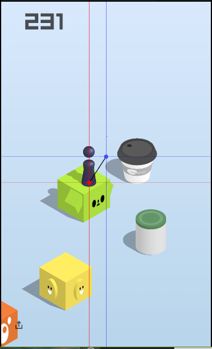
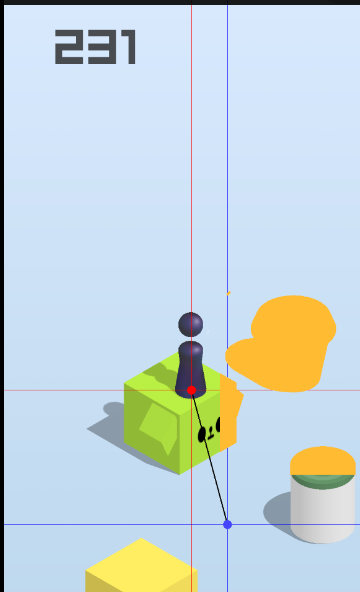

# 有一个小Bug


https://github.com/wangshub/wechat_jump_gam
https://github.com/wangshub/wechat_jump_gam
https://github.com/wangshub/wechat_jump_gam
https://github.com/wangshub/wechat_jump_gam

有时候会把白色的小点识别成物件， 是微信的干扰吗？



扫描后可以发现在中间出现一个被识别成黄色的点




## 解决方法

新加判断条件， 读取Y轴下方5像的颜色， 如果是背景色则可以排除是干扰点。
```python

            # 检查Y轴面5个像素， 和背景色相同， 那么是干扰
            ver_pixel = im_pixel[j, i + 5]
            # 修掉圆顶的时候一条线导致的小 bug，这个颜色判断应该 OK，暂时不提出来
            if abs(pixel[0] - last_pixel[0]) \
                    + abs(pixel[1] - last_pixel[1]) \
                    + abs(pixel[2] - last_pixel[2]) > 10 \
                    and abs(ver_pixel[0] - last_pixel[0]) \
                    + abs(ver_pixel[1] - last_pixel[1]) \
                    + abs(ver_pixel[2] - last_pixel[2]) > 10 \
                    :
```


## 仅更新了 wechat_jump_auto.py
